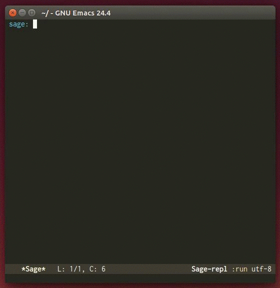

# Overview
`helm-sage` provides a helm source for
[sage-shell-mode](https://github.com/stakemori/sage-shell-mode).



# Installation
You will be able to install `helm-sage` from
[MELPA](https://github.com/milkypostman/melpa.git) by package.el
(`M-x package-install helm-sage`).

# Setting
Call `helm-sage-shell` by `M-x helm-sage-shell`
or bind `helm-sage-shell` to a key, e.g.

```lisp
(defun helm-sage-set-up ()
  (local-set-key (kbd "C-c C-i") 'helm-sage-shell))
(add-hook 'sage-shell-mode-hook 'helm-sage-set-up)
```
